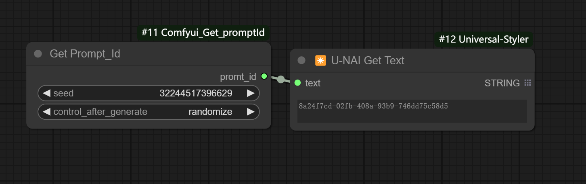
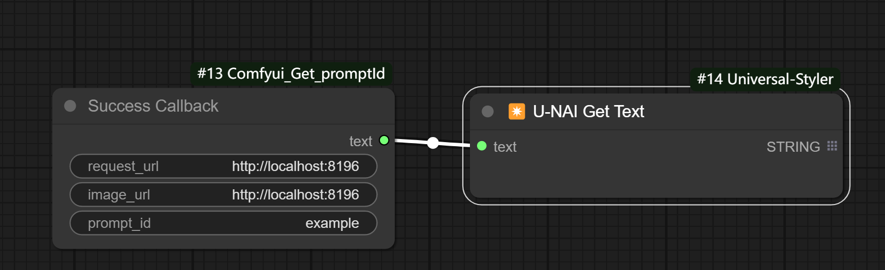

# Comfyui_Get_promptId
get comfyui task id

# success_callback
Callback for successful image generation, in conjunction with the back-end

# install
in custom_nodes 
git clone https://github.com/xs315431/Comfyui_Get_promptId.git